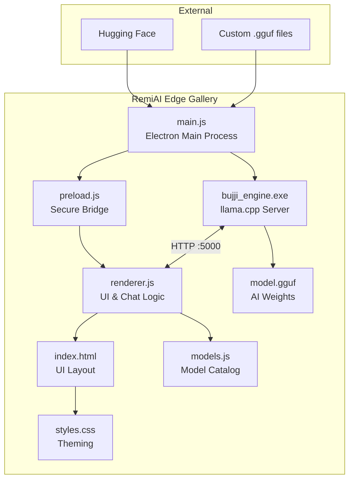
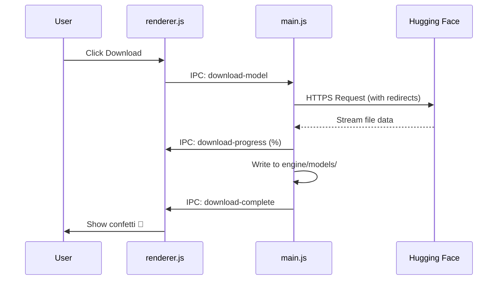
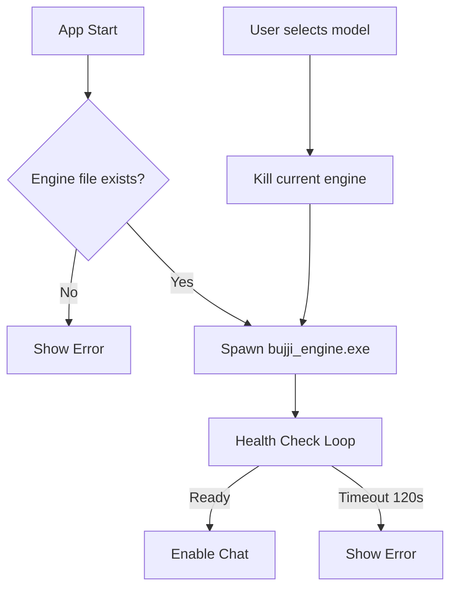

# RemiAI Edge Gallery - Technical Report

## 1. Executive Summary

This report details the architecture and operation of **RemiAI Edge Gallery**, an open-source Electron desktop application for offline AI interaction. The framework enables users to run Large Language Models (LLMs) locally using GGUF format without Python dependencies. It features automatic hardware optimization, a model download gallery, custom model upload with drag-and-drop, configurable storage management, custom AI characters, conversation memory with speed mode, and an optional **Think Mode** for chain-of-thought reasoning.

## 2. System Architecture

### 2.1 Architecture Diagram



### 2.2 Component Overview

| Component | Role | Key Responsibilities |
|-----------|------|---------------------|
| `main.js` | Main Process | Window management, engine lifecycle, IPC handlers, file operations, disk space detection, storage management |
| `preload.js` | Security Bridge | Exposes safe APIs to renderer via contextBridge |
| `renderer.js` | UI Logic | Chat functionality, model management, settings, speed mode, think mode, custom characters |
| `models.js` | Data Store | Model catalog with URLs, metadata, 7+1 AI characters |
| `bujji_engine.exe` | AI Backend | llama.cpp-based inference server on port 5000 |

## 3. Key Features Implementation

### 3.1 Model Download System



### 3.2 Storage Management

The application manages model storage through a configurable directory system:

1. **First Launch**: `promptForModelsDir()` shows a directory picker dialog
2. **Configuration**: User's choice saved to `userData/config.json`
3. **Change Location**: `select-models-dir` IPC moves all `.gguf` files to new directory
4. **Disk Space**: Detected via PowerShell `Get-PSDrive` with `fs.statfsSync` fallback
5. **Low-Space Alert**: Warning modal shown before download if space is insufficient (non-blocking)

### 3.3 Custom Model Upload

The application supports importing user's own `.gguf` model files:

1. **Upload Zones**: Drag-and-drop areas in Model Gallery and My Models views
2. **File Selection**: Native dialog via `dialog.showOpenDialog()`
3. **GGUF Validation**: Checks file magic bytes = "GGUF"
4. **Safe Filename**: Sanitizes model name for filesystem
5. **File Copy**: Copies to configured models directory
6. **Registration**: Adds to localStorage custom_models list
7. **Permanent Deletion**: `fs.unlinkSync()` with post-deletion verification

### 3.4 Conversation Memory

- Messages stored in `messages[]` array in renderer
- Last 20 messages sent with each API request (Normal Mode)
- OpenAI-compatible chat completions format
- Speed Mode: Only sends current message (no history) for independent, fast replies

### 3.5 Think Mode (Chain-of-Thought)

- **Opt-in setting** in the Chat Settings panel (🧠 Think Mode checkbox)
- When enabled, appends a chain-of-thought instruction to the system prompt
- Model is asked to put internal reasoning inside `<think>...</think>` tags
- During streaming, a pulsing 🧠 "Thinking" indicator shows live reasoning content
- After completion, thinking content is displayed in a **collapsible block** (collapsed by default)
- User can click "Thought for Xs" header to expand and view the reasoning process
- If the model doesn't support `<think>` tags, the response renders normally without duplication
- Thinking content is saved in chat history for later review

### 3.5 AI Characters & Custom System Prompt

- 7 built-in characters with predefined system prompts: Assistant, Tutor, Coder, Creative Writer, Scientist, Translator, Philosopher
- Custom Character option: User writes their own system prompt via textarea in settings
- Custom instruction persisted in `localStorage`

### 3.6 Engine Management



**Error Handling Improvements:**
- `isModelLoading` flag suppresses errors during loading
- `windowDestroyed` flag prevents errors on app close
- `safeSend()` helper validates window before IPC

## 4. IPC Communication

### 4.1 Main Process Handlers

| Channel | Direction | Purpose |
|---------|-----------|---------|
| `switch-model` | R→M | Load a new model file (with context size) |
| `download-model` | R→M | Download from URL |
| `cancel-download` | R→M | Abort current download |
| `delete-model` | R→M | Permanently remove model file |
| `check-model` | R→M | Validate GGUF file |
| `select-model-file` | R→M | Open file dialog |
| `import-custom-model` | R→M | Copy custom model |
| `get-system-info` | R→M | RAM, disk stats, models path |
| `select-models-dir` | R→M | Change storage location (moves all models) |
| `get-models-dir` | R→M | Get current storage path |

### 4.2 Main Process Events

| Channel | Direction | Purpose |
|---------|-----------|---------|
| `download-progress` | M→R | Download percentage |
| `download-complete` | M→R | Download finished |
| `model-ready` | M→R | Engine loaded model |
| `engine-error` | M→R | Engine failure |

## 5. Data Flow

### 5.1 Chat Message Flow

```
User Input → renderer.js → HTTP POST localhost:5000/v1/chat/completions
                                       ↓
Display ← renderer.js ← Streaming Response (SSE)
```

### 5.2 Model Storage

```
Catalog Models: models.js → MODEL_CATALOG object
Custom Models: localStorage → custom_models array
Downloaded IDs: localStorage → downloaded_models array
Model Files: <user-chosen-dir>/*.gguf
Storage Config: userData/config.json → { modelsDir: "..." }
User Settings: localStorage → model_settings (context, tokens, character, custom prompt, speedMode, thinkMode)
```

## 6. Technical Specifications

### 6.1 API Format

The engine exposes an OpenAI-compatible API:

```json
POST /v1/chat/completions
{
    "messages": [
        {"role": "system", "content": "..."},
        {"role": "user", "content": "..."},
        {"role": "assistant", "content": "..."}
    ],
    "stream": true,
    "max_tokens": 1000,
    "temperature": 0.7
}
```

### 6.2 Model Requirements

| RAM | Max Parameters | Example Models |
|-----|----------------|----------------|
| 8GB | < 1B | SmolLM2-360M, Qwen2.5-0.5B |
| 16GB | < 7B | Phi-3.5, Llama-3.2-3B, Gemma-2 |
| 32GB+ | 7B+ | Yi-1.5-6B, larger models |

### 6.3 File Structure

```
remiai-edge-gallery/
├── main.js              # Main process (~480 lines)
├── preload.js           # Secure bridge (~30 lines)
├── renderer.js          # UI logic (~810 lines)
├── models.js            # Model catalog (~260 lines)
├── index.html           # UI structure (~300 lines)
├── styles.css           # Styling (~1255 lines)
├── engine/
│   ├── cpu_avx/         # AVX binaries
│   └── cpu_avx2/        # AVX2 binaries (faster)
├── package.json
├── README.md
├── document.md
└── report.md
```

## 7. Security Considerations

- **Content Security Policy**: Restricts script/style sources
- **Context Isolation**: Enabled for renderer security
- **Preload Script**: Only exposes necessary APIs
- **Input Sanitization**: HTML escaped before display
- **File Validation**: GGUF magic bytes checked before import

## 8. Performance Optimizations

1. **Streaming Responses**: SSE for real-time output
2. **Speed Mode**: No conversation history sent — each reply is independent
3. **Think Mode**: Optional chain-of-thought reasoning with collapsible UI display
4. **Configurable Context**: Engine `-c` parameter set from user settings (512-8192)
5. **Input Token Limit**: Long messages truncated to prevent token overflow
6. **Model Caching**: Engine keeps model in memory
7. **Efficient Downloads**: Resume support via HTTP redirects
8. **PowerShell Disk Detection**: Fast, reliable free space checking

## 9. Error Handling

| Error Type | Handling |
|------------|----------|
| Engine startup failure | Retry with timeout, show user error |
| Model loading error | Suppress during loading phase |
| Download failure | Display error notification |
| Low disk space | Warning modal with "Download Anyway" option |
| Window close during operation | Safe cleanup with flags |
| Invalid GGUF file | Validation before import |
| Disk detection failure | Fallback methods, show "Unknown" |

## 10. Future Enhancements

- GPU acceleration support (CUDA/ROCm)
- Multi-model comparison interface
- Export chat history
- Plugin system for custom features
- Model benchmarking tools

## 11. Conclusion

RemiAI Edge Gallery democratizes local AI by eliminating complex Python environments and packaging everything needed in a simple `npm start` command. With conversation memory, Think Mode for chain-of-thought reasoning, custom model upload, and a curated model gallery, users can experiment with AI offline on any modern Windows laptop.

---

**Version**: 1.1.0  
**License**: MIT  
**Author**: RemiAI Team
